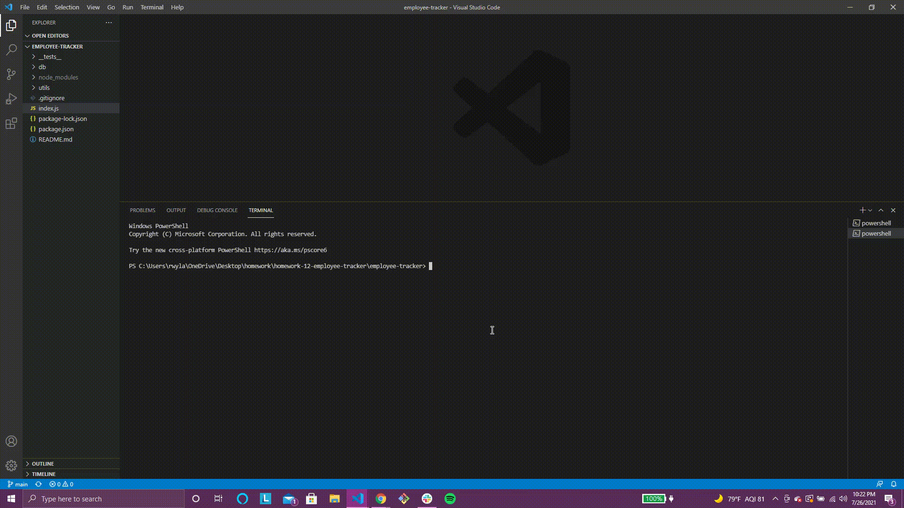

# Employee Tracker

  # Table of Contents
  * [Description](#description)
  * [Installation](#installation)
  * [Usage](#usage)
  * [Contributing](#contributing)
  * [Tests](#tests)
  * [Questions](#Questions)
 
  ## Walkthrough Video
  ### Link
  https://drive.google.com/file/d/1RGs1fzQSdLn9wGnSdSjg4hViFFCkS1hF/view

  ### View as GIF
  

  ## Description
  A command-line application that allows a user to view all departments, roles, and employees within a company. These tables (departments, roles, employees) are all contained in the same database, employeeTracker.

  ## Installation
  Clone repository from GitHub. Install Node.js. Install Inquirer package. Install MySQL2 package. Install console.table package.

  ## Usage
  Start the application by typing "node index.js" at the command line. Answer the series of prompts.

  ## Contributing
  Made with ❤️ by Becca Wyland.

  ## Tests
  inputCheck.test.js

  ## Questions
  For any questions regarding this app, please email rwyland@uwalumni.com or visit https://github.com/rwyland189.